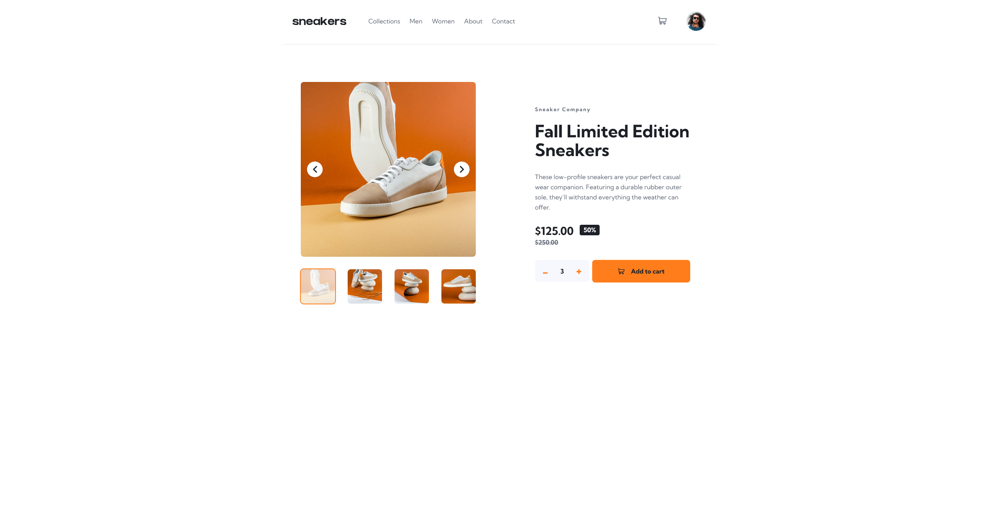

# Frontend Mentor - E-commerce product page solution

This is a solution to the [E-commerce product page challenge on Frontend Mentor](https://www.frontendmentor.io/challenges/ecommerce-product-page-UPsZ9MJp6). Frontend Mentor challenges help you improve your coding skills by building realistic projects.

## Table of contents

- [Overview](#overview)
  - [The challenge](#the-challenge)
  - [Screenshot](#screenshot)
  - [Links](#links)
- [My process](#my-process)
  - [Built with](#built-with)
  - [What I learned](#what-i-learned)
  - [Continued development](#continued-development)
  - [Useful resources](#useful-resources)
- [Author](#author)
- [Acknowledgments](#acknowledgments)

## Overview

### The challenge

Users should be able to:

- View the optimal layout for the site depending on their device's screen size
- See hover and focus states for all interactive elements on the page
- Open a lightbox gallery by clicking on the large product image (desktop only)
- Switch the main product image by clicking on the thumbnail images
- Add items to the cart
- View the cart and remove items from it
- Close open UI layers (menu, cart, lightbox) using the Escape key

### Screenshot

### Links

- Live Site URL: *[Page](https://d0bbysocks.github.io/eCommerce/)*

## My process

### Built with

- Semantic HTML5 markup
- CSS custom properties (design tokens)
- Flexbox
- Mobile-first workflow
- Vanilla JavaScript
- Accessible patterns (ARIA attributes, keyboard support)

### What I learned

This project was a lot of fun and had a very satisfying difficulty curve.

I ran into many small hurdles that required stopping, thinking, researching, and refactoring — especially around state handling and separating concerns between similar components (carousel vs. lightbox).

Key things I learned and reinforced:

- Managing shared and separate state between components (page carousel vs. lightbox carousel)
- Treating thumbnails as a “source of truth” for navigation
- Keeping desktop-only behavior (lightbox) clearly separated from mobile logic
- Using `hidden` consistently for UI state instead of CSS hacks
- Handling keyboard interactions (Escape) in a clean and predictable way
- Structuring JavaScript so complexity stays understandable even as features grow

Overall, this felt like a very natural step up in difficulty compared to earlier projects, without ever becoming frustrating.

### Continued development

In future projects, I want to continue focusing on:

- Cleaner separation of logic and state
- Improving accessibility even further (focus trapping, better screen reader flows)
- Writing more reusable UI logic patterns
- Staying disciplined with structure as projects grow in size

### Useful resources

- Frontend Mentor community solutions for inspiration and comparison
- MDN Web Docs for JavaScript, ARIA attributes, and accessibility patterns
- CSS-Tricks articles for layout and component patterns

## Author

- Frontend Mentor: *D0bbysocks*
- GitHub: *[D0bby](https://github.com/D0bbysocks)*

## Acknowledgments

Thanks to Frontend Mentor for consistently well-designed challenges.
This one was especially fun due to its balance of UI, state management, and accessibility considerations.
